# Nepali Law Bot 🏛️

A RAG (Retrieval-Augmented Generation) based legal assistant for Nepali law, featuring hierarchical legal document retrieval, confidence scoring for hallucination detection, and structured output parsing.

## Features

- **Hierarchical Legal Retrieval**: Respects legal hierarchy (Constitution → Muluki Act → Acts → Rules)
- **Confidence Scoring**: Detects potential hallucinations with relevance-based confidence metrics
- **Structured Output**: Pydantic-based parsing for legal citations, sources, and formatted responses
- **Bilingual Support**: Handles queries in both English and Nepali (नेपाली)
- **Dual Storage**: MongoDB for metadata + Qdrant for vector embeddings
- **Semantic Search**: Uses multilingual-e5-large embeddings for accurate retrieval

## Architecture

```mermaid
graph TB
    A[User Query] --> B[NepaliLawBot]
    B --> C[Language Detection<br/>langdetect]
    B --> D[ContextRetrieval]
    
    D --> E[Embedding Model<br/>multilingual-e5-large]
    E --> F[Qdrant Vector DB]
    
    F --> G[Hierarchical Search]
    G --> G1[1. Constitution]
    G --> G2[2. Muluki Act]
    G --> G3[3. Acts]
    G --> G4[4. Rules]
    
    G --> H[MongoDB Metadata]
    H --> I[Metadata Reranking]
    
    I --> I1[Extract Legal Refs<br/>दफा, परिच्छेद, भाग]
    I --> I2[Boost Matching Docs<br/>30% section, 20% chapter]
    I --> I3[Priority Boost<br/>Constitution +10%]
    
    I2 --> J[Confidence Scoring]
    I3 --> J
    
    J --> K{Score >= Threshold?}
    K -->|Yes| L[Build Context]
    K -->|No| M[Add Warning]
    
    L --> N[Groq LLM<br/>llama-3.1-8b]
    M --> N
    
    N --> O[OutputParser]
    O --> P[Structured Response]
    P --> P1[Legal Citations]
    P --> P2[Source Documents]
    P --> P3[Confidence Score]
    
    P --> Q[User]
    
    style B fill:#4CAF50
    style D fill:#2196F3
    style I fill:#FF6B6B
    style N fill:#FF9800
    style O fill:#9C27B0
    style P fill:#E91E63
```



## Key Features

### 1. **Hierarchical Legal Retrieval**
Respects Nepali legal hierarchy:
- **Constitution** (संविधान) - Highest authority, Priority 1
- **Muluki Act** (मुलुकी ऐन) - Civil/Criminal Code, Priority 2
- **Acts** (ऐन) - Specific legislation, Priority 3
- **Rules** (नियम/विनियम) - Procedural guidelines, Priority 4

The system searches top-down and stops at the highest authority that has relevant documents, then always appends Rules for procedural context.

### 2. **Metadata-Based Reranking** 🆕
Automatically boosts document relevance based on legal structure:
- **Section Match** (दफा): 30% boost when query mentions specific sections
- **Chapter Match** (परिच्छेद): 20% boost for chapter references
- **Part Match** (भाग): 15% boost for part references
- **Document Priority**: Constitution +10%, Muluki Act +5%

This works automatically - users don't need to know section numbers!

### 3. **Confidence Scoring**
Multi-factor confidence calculation:
- Weighted average of similarity scores (top results weighted higher)
- Penalty for low top score (< 0.3)
- Penalty for insufficient results (< 2 documents)
- Automatic warning when confidence < 50%

### 4. **Structured Output Parsing**
Pydantic models ensure consistent responses:
- **LegalResponse**: Main response with answer, citations, confidence
- **LegalCitation**: Extracted legal references (दफा, परिच्छेद, भाग)
- **SourceDocument**: Retrieved documents with relevance scores

### 5. **Bilingual Support**
- Automatic language detection (English/Nepali)
- Language-specific system prompts
- Explicit instruction to respond in query language
- Handles Nepali legal terminology in English queries

## System Components

### 1. **Document Ingestion** (`src/ingestion.py`)
- Extracts text from PDF legal documents using pdfplumber
- Chunks documents by legal sections (दफा) with minimum 100 chars
- Detects document type and assigns priority (Constitution=1, Muluki=2, Act=3, Rule=4)
- Extracts legal structure metadata (भाग, परिच्छेद, दफा, उपदफा)
- Stores vector embeddings in Qdrant
- Stores rich metadata in MongoDB (structure, priority, file path)

### 2. **Context Retrieval** (`src/retrieval.py`)
- **Hierarchical Search**: Queries Qdrant with legal hierarchy filtering
- **Metadata Reranking**: Boosts documents matching query's legal references
- **Confidence Scoring**: Calculates weighted relevance scores
- **Document Filtering**: Removes low-confidence results (< 0.3 similarity)
- **Context Building**: Formats documents with legal structure for LLM

### 3. **Chatbot** (`src/chatbot.py`)
- **Language Detection**: Identifies English vs Nepali queries
- **Query Processing**: Orchestrates retrieval → reranking → generation pipeline
- **LLM Integration**: Calls Groq API with language-specific prompts
- **Response Structuring**: Returns formatted LegalResponse objects
- **Interactive Chat**: Provides command-line interface

### 4. **Output Parser** (`src/output_parser.py`)
- **Pydantic Models**: Validates response structure
- **Citation Extraction**: Automatically finds legal references in answers
- **Response Formatting**: Creates readable output with confidence bars
- **Warning System**: Alerts users when confidence is low

### 5. **Configuration** (`src/config.py`)
- Centralized environment variable management
- Database connection settings (MongoDB, Qdrant, Groq)
- Model configurations (embedding model, LLM parameters)
- Language-specific system prompts
- Retrieval limits and confidence thresholds

### 6. **Utilities** (`src/utils.py`)
- Logging setup with configurable levels
- Colored console output for better UX
- Legal reference extraction (sections, chapters, parts)
- Text formatting and truncation helpers

## Setup Instructions

### Prerequisites

- Python 3.8 or higher
- MongoDB Atlas account (or local MongoDB)
- Qdrant Cloud account (or local Qdrant)
- Groq API key

### Installation

1. **Clone or navigate to the project directory**
   ```bash
   cd "c:\Users\NITRO\OneDrive\Documents\rag projects\nepali-law-bot"
   ```

   **Note**: Using `python -m venv venv` is recommended.
   
   Or manually:
   ```bash
   python -m venv venv
   venv\Scripts\activate
   pip install -r requirements.txt
   ```

3. **Configure environment variables**
   
   The `.env` file should contain:
   ```env
   MONGO_URI=mongodb+srv://...
   QDRANT_URL=https://...
   QDRANT_API_KEY=...
   GROQ_API_KEY=gsk_...
   DRIVE_LINK=https://drive.google.com/drive/folders/...  # Required - contains folders with PDF documents in my case
   ```

4. **Verify installation**
   ```bash
   python -c "import pymongo, qdrant_client, groq, sentence_transformers; print('✓ All packages installed')"
   ```

## Usage

### Interactive Chat

```bash
python main.py
```

or

```bash
python examples\query_bot.py
```


### Test Confidence Scoring

```bash
python examples\test_confidence.py
```

## Response Structure

The bot returns a `LegalResponse` object with:

```python
{
    "answer": str,                    # Main answer text
    "citations": List[LegalCitation], # Extracted legal citations
    "confidence_score": float,        # 0-1 confidence score
    "language": str,                  # "en" or "ne"
    "sources": List[SourceDocument],  # Retrieved source documents
    "warning": Optional[str]          # Warning if confidence < threshold
}
```

## Configuration

### Key Settings (in `src/config.py`)

| Setting | Default | Description |
|---------|---------|-------------|
| `CONFIDENCE_THRESHOLD` | 0.5 | Minimum confidence to avoid warning |
| `MIN_SIMILARITY_SCORE` | 0.3 | Minimum document relevance |
| `LLM_TEMPERATURE` | 0.2 | LLM creativity (lower = more factual) |
| `LLM_MAX_TOKENS` | 600 | Maximum response length |
| `MAX_CONTEXT_CHARS` | 9000 | Maximum context for LLM |

### Document Type Hierarchy

1. **Constitution** (संविधान) - Priority 1
2. **Muluki Act** (मुलुकी) - Priority 2
3. **Acts** - Priority 3
4. **Rules** (नियम/विनियम) - Priority 4

## Project Structure

```
nepali-law-bot/
├── .env                    # Environment variables
├── .gitignore             # Git ignore patterns
├── requirements.txt       # Python dependencies
├── README.md             # This file
├── src/
│   ├── __init__.py
│   ├── config.py         # Configuration management
│   ├── ingestion.py      # Document ingestion
│   ├── retrieval.py      # Context retrieval
│   ├── chatbot.py        # Main chatbot logic
│   ├── output_parser.py  # Structured output parsing
│   └── utils.py          # Utility functions
├── examples/
│   ├── query_bot.py      # Example usage
│   └── test_confidence.py # Confidence testing
└── notebook/
    └── NEPALI_LEGAL.ipynb # Original notebook (reference)
```

## Dependencies

- **pymongo** - MongoDB client
- **qdrant-client** - Vector database
- **pdfplumber** - PDF text extraction
- **sentence-transformers** - Embedding model
- **groq** - LLM API client
- **pydantic** - Data validation
- **python-dotenv** - Environment management
- **langdetect** - Language detection
- **colorama** - Colored terminal output

## Confidence Scoring

The confidence score is calculated based on:

1. **Similarity Scores**: Weighted average of document relevance
2. **Top Result Quality**: Penalty if top result has low similarity
3. **Result Count**: Penalty if very few documents retrieved
4. **Threshold Check**: Warning if score < 0.5

### Interpretation

- **High (≥70%)**: Strong legal basis, reliable answer
- **Medium (50-70%)**: Moderate confidence, verify with expert
- **Low (<50%)**: Weak legal basis, consult legal professional


## License

This project is for educational and research purposes.

## Acknowledgments

- **Embedding Model**: intfloat/multilingual-e5-large
- **LLM**: Groq (llama-3.1-8b-instant)
- **Vector DB**: Qdrant
- **Document DB**: MongoDB

---

**Note**: This is a legal assistant tool and should not replace professional legal advice. Always consult with a qualified legal professional for important legal matters.
